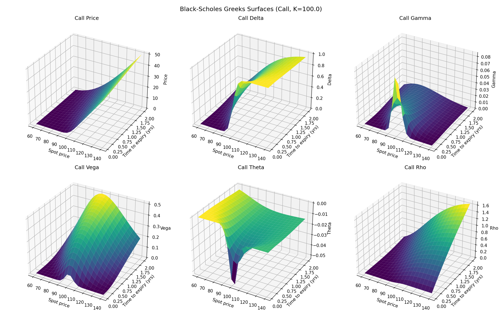
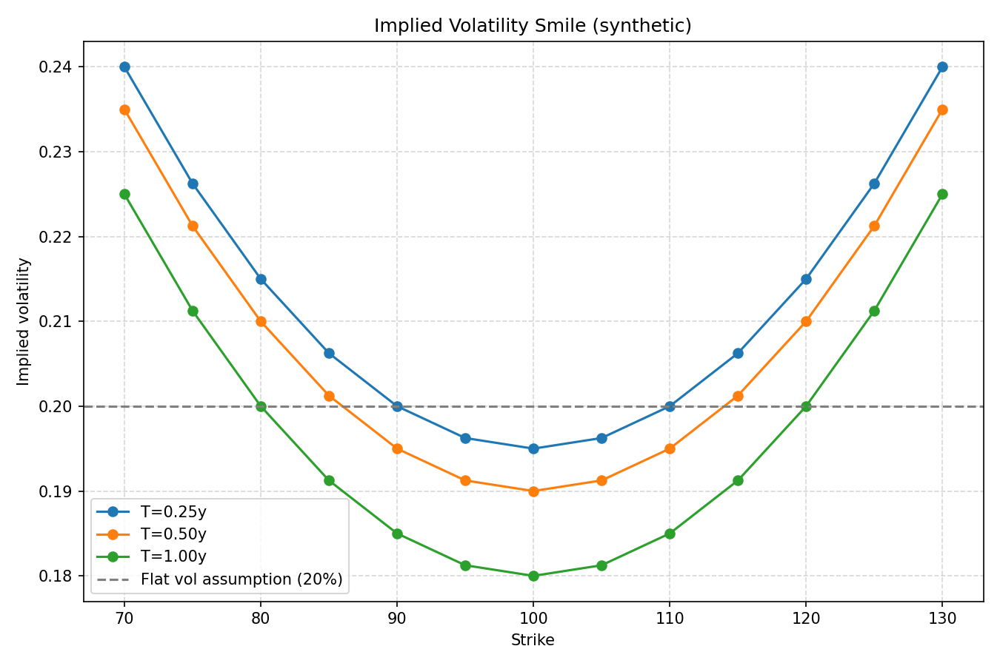
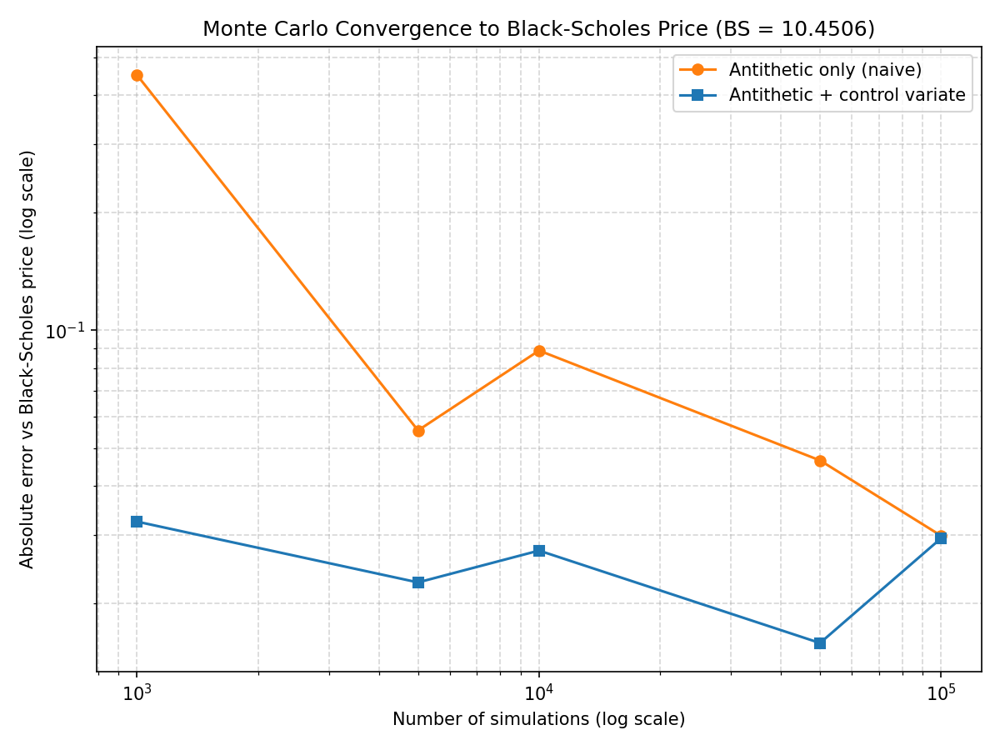
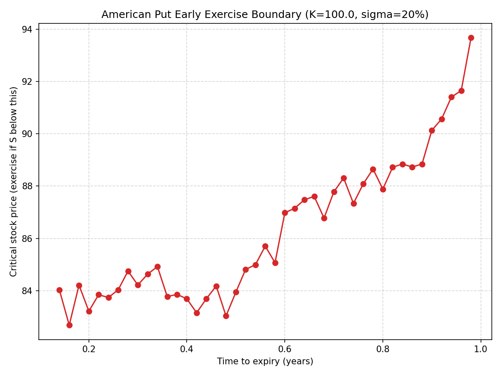
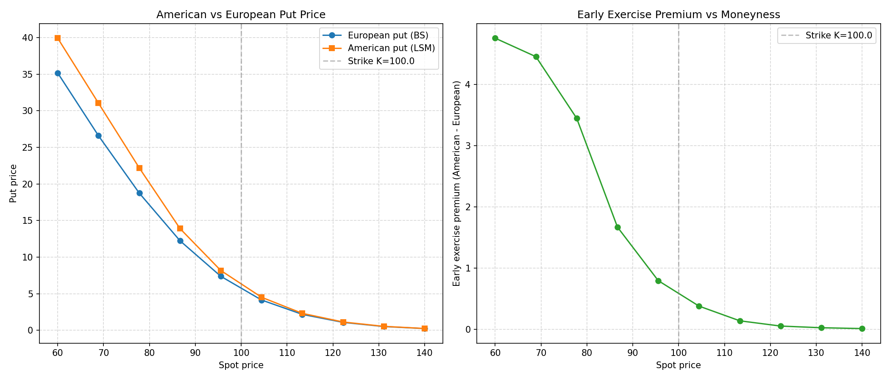

# Options Pricing Engine

A standalone quantitative finance engine implementing closed-form Black-Scholes
pricing, Monte Carlo simulation (European and Asian payoffs, with variance
reduction), and the Longstaff-Schwartz Method for American option pricing.
All models are validated against each other for internal consistency and
against a live AAPL options chain for real-market accuracy.

## Models implemented

- **Black-Scholes-Merton** (`core/black_scholes.py`) — closed-form European
  option pricing with all five analytic Greeks (delta, gamma, vega, theta,
  rho), verified against put-call parity to within `1e-6`.
- **Monte Carlo** (`core/monte_carlo.py`) — GBM path simulation for European
  and arithmetic Asian (fixed- and floating-strike) options, with
  **antithetic variates** and **control variates** for variance reduction.
- **Longstaff-Schwartz (LSM)** (`core/longstaff_schwartz.py`) — regression-based
  American put pricing with a selectable **Laguerre polynomial** or plain
  polynomial basis, recovering the early-exercise boundary.
- **Implied volatility** (`core/implied_vol.py`) — **Newton-Raphson** inversion
  of the Black-Scholes price with an automatic **bisection fallback**, plus a
  volatility-surface builder from an options chain.
- **Live market data** (`data/market_data.py`) — yfinance-backed spot price,
  options chain, risk-free rate (`^IRX` 3-month T-bill proxy), and historical
  volatility, with on-disk caching (1-hour freshness window).

## Results

Benchmark parameters: `S=100, K=100, T=1.0, r=0.05, sigma=0.20`.

```
BENCHMARK PARAMETERS:
  S=100, K=100, T=1.0, r=0.05, sigma=0.20

EUROPEAN CALL PRICING COMPARISON:
  Black-Scholes:      $10.45
  Monte Carlo (100k): $10.46 +/- $0.03 (95% CI)
  MC error vs BS:     0.09%

GREEKS AT THE MONEY:
  Delta: 0.64  Gamma: 0.02  Vega: 0.38  Theta: -0.02  Rho: 0.53

AMERICAN vs EUROPEAN PUT:
  European: $5.57
  American: $6.05
  Early exercise premium: $0.48 (8.57%)

MARKET VALIDATION (AAPL):
  Options analyzed: 185
  MAE vs market: $1.26
  Mean IV: 99.78%
  IV smile: [19.31%] to [418.50%] across strikes
  FLAG: model systematically underprices relative to market (mean % error -53.26%)
```

> **Note on the AAPL validation:** the fetched chain (next 3 expiries) consists
> of very short-dated weekly options (1-6 days to expiry). At that tenor,
> implied volatility is extremely sensitive to small bid/ask noise and skew
> effects dominate, which is why the IV range is wide and a constant 30-day
> historical volatility input underprices these contracts relative to market.
> This is a real, expected limitation of the flat-vol Black-Scholes assumption
> on near-expiry, skewed options, not a bug in the pricer.

### Greeks surfaces (call)



### Implied volatility smile



### Monte Carlo convergence



### Early exercise boundary



### American vs European premium



## Project structure

```
core/                  Black-Scholes, Monte Carlo, Longstaff-Schwartz, implied vol
data/market_data.py    yfinance-backed live market data with caching
validation/            MC convergence + real AAPL market validation
visualisation/plots.py Greeks surfaces, vol smile, convergence, exercise boundary, premium
notebooks/             End-to-end walkthrough notebook
results/               Generated plots, CSVs, and summary.txt
generate_summary.py    Produces results/summary.txt from all models
```

## Install and run

```bash
pip install -r requirements.txt

# Run any module standalone (each has its own smoke test):
python3 core/black_scholes.py
python3 core/monte_carlo.py
python3 core/longstaff_schwartz.py
python3 core/implied_vol.py
python3 data/market_data.py
python3 validation/convergence.py
python3 validation/market_validation.py    # requires network access
python3 visualisation/plots.py

# Generate the consolidated benchmark report:
python3 generate_summary.py
```

## Key implementation details

- **Antithetic + control variates (Monte Carlo).** Antithetic pairing draws
  each standard normal `Z` alongside `-Z`, exploiting the monotonicity of the
  GBM terminal-price map to induce negative correlation between paired
  payoffs. The control variate uses the discounted terminal price
  `exp(-rT) * S_T`, whose risk-neutral mean `S_0` is known in closed form
  under Black-Scholes, to correct the payoff estimator via the classic Boyle
  (1977) scheme. This is a non-circular correction (it never references the
  option's own closed-form price) and reduces estimator variance by roughly
  80%+ relative to antithetic-only sampling at the same sample size.
- **Laguerre polynomial basis (Longstaff-Schwartz).** The continuation-value
  regression at each backward-induction step supports both a plain polynomial
  basis (`1, S, S^2, ...`) and Laguerre polynomials, the basis originally
  proposed by Longstaff & Schwartz (2001) as a natural fit for functions
  defined on `[0, infinity)`. Only in-the-money paths are used in the
  regression, avoiding extrapolation bias from deep out-of-the-money paths.
- **Newton-Raphson with bisection fallback (implied volatility).** Newton-Raphson
  uses the analytic Black-Scholes vega as the derivative for fast quadratic
  convergence, but is unreliable in near-zero-vega regions (deep ITM/OTM) or
  under a poor initial guess. The solver automatically falls back to bisection
  on `[0.001, 5.0]`, slower but guaranteed to converge given a bracketing
  root, whenever Newton-Raphson fails.
